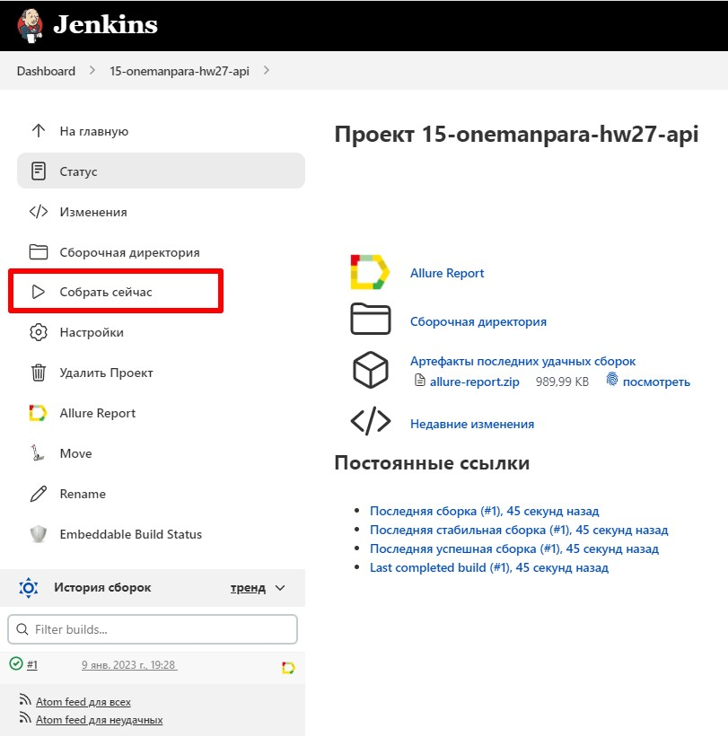
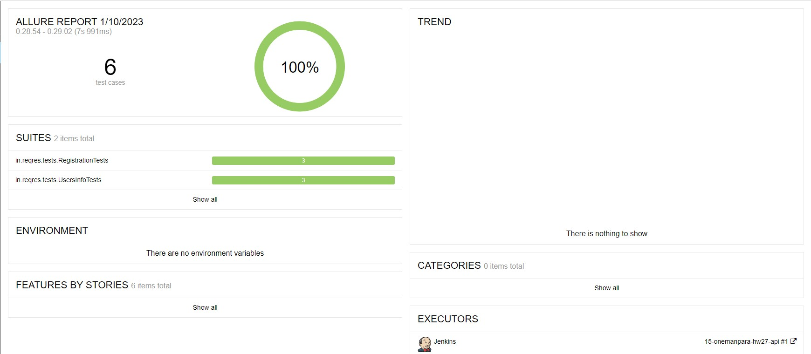
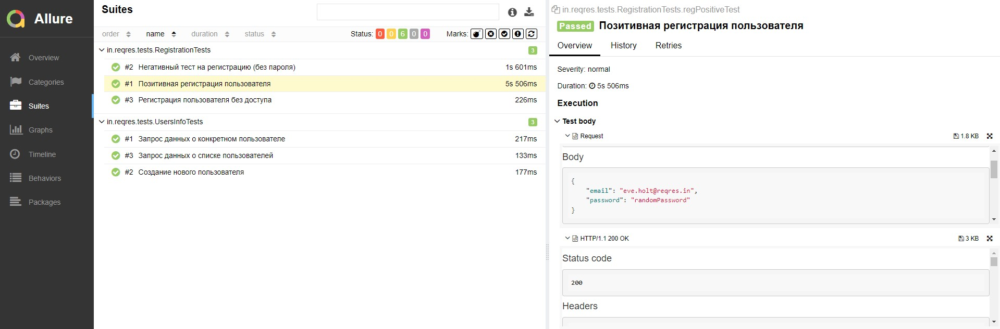

# Проект по API тестированию для [reqres.in](https://reqres.in/)

## :page_with_curl:	Содержание

> :heavy_check_mark: [Технологии и инструменты](#technologist-технологии-и-инструменты)
>
> :heavy_check_mark: [Реализованы проверки](#bookmark_tabs-реализованы-проверки)
> 
> :heavy_check_mark: [Запуск тестов из терминала](#computer-Запуск-тестов-из-терминала)
> 
> :heavy_check_mark: [Запуск тестов в Jenkins](#-запуск-тестов-в-jenkins)
>
> :heavy_check_mark: [Отчет о результатах тестирования в Allure Report](#-отчет-о-результатах-тестирования-в-allure-report)

## :technologist: Технологии и инструменты

<p  align="center">

<code></code>
<code></code>
<code></code>
<code></code>
<code></code>
<code></code>
<code></code>
<code></code>
</p>

## :bookmark_tabs: Реализованы проверки

>- [x] *Позитивная регистрация пользователя*
>- [x] *Регистрация пользователя без доступа*
>- [x] *Негативный тест на регистрацию (без пароля)*
>- [x] *Создание нового пользователя*
>- [x] *Запрос данных о списке пользователей*
>- [x] *Запрос данных о конкретном пользователе*

## :computer: Запуск тестов из терминала

Для запуска тестов используйте команду:

```bash
gradle clean test
```

##  Запуск тестов в [Jenkins](https://jenkins.autotests.cloud/job/Students/job/15-onemanpara-hw27-apiPart/)

*Для запуска сборки необходимо нажать кнопку <code><strong>*Собрать сейчас*</strong></code>.*

<p align="center">
  
</p>


##  Отчет о результатах тестирования в [Allure Report](https://jenkins.autotests.cloud/job/Students/job/15-onemanpara-hw27-apiPart/allure)

### Главное окно

<p align="center">
  
</p>

### Окно с тест-кейсами

<p align="center">
  
</p>

